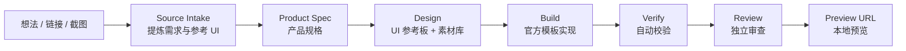
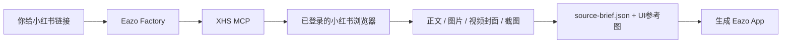
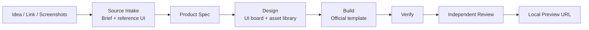

# Eazo Factory

> 用 Codex 批量式生产小而美的 Eazo App：从一句想法、小红书链接、截图素材，到设计参考图、官方模板代码、自动校验、独立 Review 和本地预览。


<p align="center">
  <a href="#中文">中文</a>
  ·
  <a href="#english">English</a>
</p>

---

## 中文

Eazo Factory 是一个 Codex Plugin，用来把零散的 app 想法、内容链接、截图素材，转成可运行、可预览、可审查的 Eazo 小应用。

它适合用来高频生产内容型、工具型、体验型的小 App，例如：

- 冥想、呼吸练习、情绪陪伴
- 日记、打卡、习惯养成
- 小红书内容复刻成互动 App
- BMI、预算、计时器、清单等轻工具
- 带艺术风格的单页体验型 App

Eazo Factory 默认使用官方 Eazo Next.js 模板，并强制加入中英文切换、真实可用按钮、设计参考图、交互映射、自动检查和独立 Review。

### 核心能力

| 能力 | 说明 |
| --- | --- |
| 一句话生成 App | 直接描述想做什么，插件会拆成产品规格、UI、代码和预览 |
| 小红书链接 / 截图复刻 | 从链接、截图、视觉素材中提炼产品需求和 UI 结构 |
| XHS MCP 优先 | 如果本地配置了小红书 MCP，会优先通过已登录浏览器读取帖子正文、图片、视频封面和截图 |
| 视频语义理解 | 对 App 介绍视频同时分析文案、语音转写和关键帧，避免只按截图瞎还原 |
| 参考 UI 入图 | 视觉类来源会保存到 `source/reference-ui/`，再作为 `$imagegen` 的参考图输入 |
| UI 素材板 | 生成一张包含移动端主界面和组件/按钮/装饰素材库的参考板 |
| 官方模板标准化 | 使用 `EazoAI/eazo-creator-nextjs-template` 作为应用基础 |
| 双语默认要求 | 每个 App 都必须有中英文切换 |
| BGM 规则 | 非纯工具型 App 默认要求匹配的用户可控 BGM |
| 无死按钮 | 所有按钮、链接、toggle、输入控件都必须有真实功能 |
| 独立 Review | 生成后必须经过功能、Bug、审美、按钮可用性和浏览器预览审查 |
| 批量生产 | 从 `links.txt` 或 `jobs.json` 并行启动多个 Codex worker，每个来源生成一个独立 App |

### 工作流




### 安装

#### 从 GitHub 安装

```bash
codex plugin marketplace add FanXuTheRealOne/eazo-factory
codex plugin add eazo-factory@eazo-tools
```

安装后建议新开一个 Codex thread，然后输入：

```text
@eazo-factory
```

插件会展示 onboarding，告诉你可以如何使用。

#### 从本地 checkout 安装

```bash
git clone https://github.com/FanXuTheRealOne/eazo-factory.git
cd eazo-factory
codex plugin marketplace add .
codex plugin add eazo-factory@eazo-tools
```

#### 更新插件

如果仓库有新版本：

```bash
codex plugin marketplace upgrade eazo-tools
codex plugin remove eazo-factory@eazo-tools
codex plugin add eazo-factory@eazo-tools
```

如果你在本地修改了 plugin，也建议 bump plugin version，然后重新 `remove/add`，避免 Codex 使用旧缓存。

### 使用方式

#### 1. 一句话生成 App

```text
@eazo-factory 创建一个马蒂斯剪纸风两分钟冥想 App，给焦虑上班族用，保存到桌面
```

适合你已经知道想做什么，只需要 Codex 帮你完整落地。

#### 2. 从小红书链接生成 App

```text
@eazo-factory 从这个小红书链接复刻成一个 Eazo App: https://www.xiaohongshu.com/...
```

如果链接被登录或验证挡住，插件会提醒你先登录自己的小红书账号，重新发送同一个链接，或者补充帖子截图。

如果你配置了 XHS MCP，插件会优先让 MCP 用“已登录的小红书浏览器”读取帖子内容，而不是直接 curl 链接。

如果来源是介绍 App 的视频，Eazo Factory 会要求 source intake 生成一个 `video_semantic_packet`：

```text
小红书文案 / 标题 / 标签
  + 视频语音转文字
  + 关键帧截图 storyboard
  → 这个 App 到底在解决什么问题、功能流是什么、哪些视觉元素必须还原
```

对应产物：

```text
source/transcript/video-transcript.txt
source/keyframes/
source/storyboard.json
source/source-brief.json
```

#### 3. 从截图或素材生成 App

```text
@eazo-factory 按这几张小红书截图做成一个打卡/日记 App
```

适合你有一组截图、视觉参考、UI 参考图、内容卡片，希望插件理解后转成原创 Eazo App。

#### 4. 批量生成多个 App

把一批小红书链接放进 `links.txt`：

```text
https://www.xiaohongshu.com/explore/...
https://www.xiaohongshu.com/explore/...
https://www.xiaohongshu.com/explore/...
```

然后在 Codex 里说：

```text
@eazo-factory 帮我把 ./links.txt 里的链接批量生成 Eazo App，输出到 ./outputs，最多同时跑 2 个
```

插件会路由到批量 runner：它不会在一个 thread 里傻循环，而是为每条链接启动一个独立 `codex exec` worker。每个 worker 再调用 `@eazo-factory` 完整跑单个 App 流程。

你也可以直接在 shell 里运行：

```bash
node plugins/eazo-factory/bin/eazo-batch.mjs run ./links.txt \
  --out ./outputs \
  --concurrency 2 \
  --style "Matisse cut paper, warm and playful"
```

先不消耗大量 token、只检查 prompts 和目录结构：

```bash
node plugins/eazo-factory/bin/eazo-batch.mjs run ./links.txt --out ./outputs --dry-run
```

批量运行会产出：

```text
outputs/
└── batch-YYYYMMDD-HHMMSS/
    ├── batch-report.json
    ├── apps/
    │   ├── 001-...
    │   └── 002-...
    └── jobs/
        ├── 001-.../prompt.txt
        ├── 001-.../final.md
        └── 001-.../stderr.log
```

### 小红书 MCP 操作指南

MCP 的作用是让 Codex 多一个“能操作小红书的本地工具”。它不是替代 Eazo Factory，而是给 Eazo Factory 提供真实帖子内容。



第一次使用：

1. 安装或启动一个支持浏览器登录的小红书 / XHS MCP。
2. 让 MCP 打开它自己的浏览器。
3. 在这个 MCP 浏览器里扫码登录小红书。
4. 重启 Codex 或重新加载 MCP 工具。
5. 正常使用：

```text
@eazo-factory 从这个小红书链接复刻成 Eazo App: https://www.xiaohongshu.com/...
```

成功时，Eazo Factory 会保存：

```text
source/raw/xhs-note.json
source/media/
source/reference-ui/ref-01.png
source/source-brief.json
```

如果 MCP 不存在，会自动降级到普通 browser/web 或截图流程。
如果 MCP 登录过期，会提示你重新扫码登录 MCP 浏览器。
如果遇到验证码/风控，不会瞎编，会要求你补截图。


### 参考 UI 机制

当输入来源包含视觉 UI，例如小红书截图、产品介绍截图、App 截图、UI/交互参考图时，Eazo Factory 会：

1. 把参考图保存到 `source/reference-ui/ref-01.png`、`ref-02.png` 等文件；
2. 在 `source/source-brief.json` 里记录 `reference_ui_images`；
3. 在设计阶段用 `view_image` 加载这些本地图片；
4. 把它们作为 `$imagegen` 的视觉参考输入；
5. 生成原创的 Eazo UI 参考板，而不是照抄水印、创作者身份或长文案。

只有当用户明确说“不使用参考图”，或指定了完全不同的 UI/艺术风格时，插件才会跳过参考图，并在 `reference_ui_note` 中记录原因。

### 产物结构

每次成功运行通常会产生：

```text
my-eazo-app/
  product-spec.json
  source/
    source-brief.json
    reference-ui/
      ref-01.png
  design/
    ui-reference.png
    image-prompt.md
    design-tokens.json
    interaction-map.json
    asset-library.json
  review/
    review.json
    control-audit.json
  factory-run.json
  src/
```

其中：

- `product-spec.json` 是产品规格；
- `design/ui-reference.png` 是 UI 参考板；
- `design/interaction-map.json` 是所有真实可交互控件的映射；
- `design/asset-library.json` 是按钮、装饰、背景、状态元素、BGM 情绪等素材清单；
- `review/` 是独立 Review 的审查结果。

### Review 标准

Eazo Factory 的 review agent 会检查：

1. 核心功能是否完整；
2. 是否存在明显 Bug；
3. 前端页面是否足够美观；
4. 是否有不能用的按钮；
5. 所有出现的按钮是否都有真实功能；
6. 中英文切换是否存在；
7. 需要 BGM 的 App 是否有用户可控的 BGM；
8. 浏览器预览中交互是否真的可用。

没有通过 review gate 的 App 不应该被当成完成品。

### 本地要求

你需要：

- Codex App 或 Codex CLI
- Git
- Bun
- Node.js
- 可访问 GitHub
- Codex 当前环境中可用的 `$imagegen`
- 浏览器工具，用于最终视觉和交互 Review

### 安全边界

Eazo Factory 默认不会：

- 自动部署；
- 自动发布；
- 自动 push 生成的 App repo；
- 读取或提交 secrets；
- 复制水印、创作者身份、隐私资料或长篇原文。

### 常见问题

#### 为什么我更新了 plugin，但 Codex 还是旧行为？

Codex 会把 plugin 安装到本地 cache。改了 plugin 后需要 bump version，并重新安装：

```bash
codex plugin remove eazo-factory@eazo-tools
codex plugin add eazo-factory@eazo-tools
```

#### 小红书链接打不开怎么办？

先在本地浏览器登录自己的小红书账号，再重新发送同一个链接。如果仍然被验证挡住，直接上传帖子截图。

#### 能不能批量生成？

可以。`0.1.5+` 内置 `eazo-batch`，支持 `links.txt` / `jobs.json`，并通过多个 `codex exec` worker 并行调用 `@eazo-factory`。建议先从 `--concurrency 2` 开始，避免 token、本地资源和小红书风控瞬间打满。

#### 可以给同事用吗？

可以。同事只需要添加这个 GitHub marketplace 并安装 plugin：

```bash
codex plugin marketplace add FanXuTheRealOne/eazo-factory
codex plugin add eazo-factory@eazo-tools
```

### 项目结构

```text
.
├── .agents/plugins/marketplace.json
├── plugins/eazo-factory/
│   ├── .codex-plugin/plugin.json
│   ├── bin/
│   │   └── eazo-batch.mjs
│   ├── skills/
│   │   ├── eazo-batch/
│   │   ├── eazo-factory/
│   │   ├── eazo-source/
│   │   ├── eazo-idea/
│   │   ├── eazo-design/
│   │   ├── eazo-build/
│   │   └── eazo-review/
│   ├── references/
│   ├── scripts/
│   └── tests/
└── docs/
```

### 开发与验证

```bash
bash -n plugins/eazo-factory/scripts/*.sh plugins/eazo-factory/scripts/lib/common.sh plugins/eazo-factory/tests/*.sh
bash plugins/eazo-factory/tests/test-manifest.sh
bash plugins/eazo-factory/tests/test-onboarding.sh
bash plugins/eazo-factory/tests/test-source-login-wall.sh
bash plugins/eazo-factory/tests/test-source-reference-ui.sh
bash plugins/eazo-factory/tests/test-scaffold.sh
bash plugins/eazo-factory/tests/test-verify.sh
```

---

## English

Eazo Factory is a Codex Plugin for turning lightweight app ideas, Xiaohongshu links, screenshots, and visual references into polished, reviewed, previewable Eazo apps.

It is designed for high-throughput creation of small apps such as:

- meditation, breathing, emotional support, and wellness apps;
- journals, check-ins, and habit trackers;
- Xiaohongshu content transformed into interactive apps;
- lightweight utilities such as BMI calculators, timers, lists, and budget tools;
- art-directed one-page experiences.

Eazo Factory uses the official Eazo Next.js template and enforces bilingual support, real controls, UI reference boards, interaction maps, deterministic verification, and independent review.

### Core Features

| Feature | Description |
| --- | --- |
| One-prompt app generation | Describe the app once; Eazo Factory scopes, designs, builds, verifies, reviews, and previews it |
| Source-based generation | Extracts app briefs from Xiaohongshu links, screenshots, visual material, or pasted posts |
| XHS MCP first | Uses an authenticated Xiaohongshu MCP/browser source collector when available |
| Video understanding | Combines post copy, speech transcript, and keyframe storyboard for app-demo videos |
| Reference UI capture | Saves visual references under `source/reference-ui/` and feeds them into `$imagegen` |
| UI reference board | Generates one board with a mobile screen plus reusable UI/asset specimens |
| Official template | Standardizes output with `EazoAI/eazo-creator-nextjs-template` |
| Bilingual by default | Every app must include English/Chinese switching |
| BGM rule | Experiential apps require user-controlled matching BGM |
| No dead buttons | Every visible control must have a real purpose |
| Independent review | Checks core functionality, bugs, frontend quality, and every visible control |
| Batch production | Launches parallel Codex workers from `links.txt` or `jobs.json`, one source per independent app |

### Workflow




### Installation

#### Install from GitHub

```bash
codex plugin marketplace add FanXuTheRealOne/eazo-factory
codex plugin add eazo-factory@eazo-tools
```

After installation, start a new Codex thread and type:

```text
@eazo-factory
```

The plugin will show onboarding with usage examples.

#### Install from a local checkout

```bash
git clone https://github.com/FanXuTheRealOne/eazo-factory.git
cd eazo-factory
codex plugin marketplace add .
codex plugin add eazo-factory@eazo-tools
```

#### Upgrade

```bash
codex plugin marketplace upgrade eazo-tools
codex plugin remove eazo-factory@eazo-tools
codex plugin add eazo-factory@eazo-tools
```

When editing locally, bump the plugin version before reinstalling so Codex does not reuse an old cache snapshot.

### Usage

#### 1. Build from one sentence

```text
@eazo-factory Create a Matisse cut-paper two-minute meditation app for anxious office workers, save to Desktop
```

Use this when you already know the app concept and want Codex to complete the full workflow.

#### 2. Build from a Xiaohongshu link

```text
@eazo-factory Turn this Xiaohongshu link into an Eazo app: https://www.xiaohongshu.com/...
```

If the link is blocked by login or verification, Eazo Factory will ask the user to log in locally, resend the same link, or upload screenshots.

If XHS MCP is configured, Eazo Factory tries it first so the note can be read through an authenticated Xiaohongshu browser instead of a plain HTTP fetch.

#### 3. Build from screenshots or assets

```text
@eazo-factory Make a check-in / journal app from these screenshots
```

Use this when you have screenshots, UI references, content cards, or moodboards and want the plugin to derive an original Eazo app from them.

#### 4. Batch-generate many apps

Create a `links.txt` file:

```text
https://www.xiaohongshu.com/explore/...
https://www.xiaohongshu.com/explore/...
https://www.xiaohongshu.com/explore/...
```

Then ask Codex:

```text
@eazo-factory Batch-generate Eazo apps from ./links.txt, output to ./outputs, max concurrency 2
```

Or run the CLI directly:

```bash
node plugins/eazo-factory/bin/eazo-batch.mjs run ./links.txt \
  --out ./outputs \
  --concurrency 2 \
  --style "Matisse cut paper, warm and playful"
```

Dry-run first to inspect prompts and folder structure without launching token-heavy workers:

```bash
node plugins/eazo-factory/bin/eazo-batch.mjs run ./links.txt --out ./outputs --dry-run
```

The runner creates `batch-report.json`, one `jobs/<id>/` log folder per source, and one `apps/<id>/` app folder per source.

### Xiaohongshu MCP guide

XHS MCP gives Codex a local Xiaohongshu source collector. It does not replace Eazo Factory; it gives Eazo Factory access to authenticated post content.

First-time setup:

1. Install or start a community Xiaohongshu / XHS MCP server with browser login support.
2. Let the MCP open its own browser.
3. Scan the QR code and log in to Xiaohongshu inside that MCP browser.
4. Restart Codex or reload MCP tools.
5. Use Eazo Factory normally:

```text
@eazo-factory Turn this Xiaohongshu link into an Eazo app: https://www.xiaohongshu.com/...
```

When it works, Eazo Factory saves:

```text
source/raw/xhs-note.json
source/media/
source/reference-ui/ref-01.png
source/source-brief.json
```

If MCP is unavailable, it falls back to browser/web or screenshots. If login expires, log in again through the MCP browser. If CAPTCHA or anti-bot verification blocks access, upload screenshots.


### Reference UI Handling

When the source contains visual UI material, Eazo Factory:

1. saves reference images as `source/reference-ui/ref-01.png`, `ref-02.png`, and so on;
2. records them in `source/source-brief.json` as `reference_ui_images`;
3. loads each local image with `view_image` during design;
4. passes the loaded images into `$imagegen` as visual references;
5. generates an original Eazo UI reference board without reproducing watermarks, creator identity, private data, or long captions.

The reference image path is skipped only when the user explicitly opts out or asks for a different UI/style. In that case, the reason is recorded in `reference_ui_note`.

### Output Structure

Successful runs typically produce:

```text
my-eazo-app/
  product-spec.json
  source/
    source-brief.json
    reference-ui/
      ref-01.png
  design/
    ui-reference.png
    image-prompt.md
    design-tokens.json
    interaction-map.json
    asset-library.json
  review/
    review.json
    control-audit.json
  factory-run.json
  src/
```

### Review Gate

The review agent checks:

1. core functionality;
2. obvious bugs;
3. frontend quality;
4. unusable buttons;
5. whether every visible control has a real purpose;
6. bilingual switching;
7. required BGM behavior;
8. browser-preview interaction quality.

An app should not be considered finished until it passes the review gate.

### Requirements

- Codex App or Codex CLI
- Git
- Bun
- Node.js
- GitHub access
- `$imagegen` available in the active Codex environment
- Browser tooling for final visual and interaction review

### Safety

Eazo Factory does not automatically:

- deploy apps;
- publish apps;
- push generated app repositories;
- commit secrets;
- reproduce watermarks, creator identity, private profile data, or long source captions.

### FAQ

#### Why does Codex still use old plugin behavior after I update files?

Codex installs plugins into a local cache. Bump the plugin version and reinstall:

```bash
codex plugin remove eazo-factory@eazo-tools
codex plugin add eazo-factory@eazo-tools
```

#### What if Xiaohongshu blocks the link?

Log in to Xiaohongshu in your local browser and resend the same link. If verification still blocks access, upload screenshots.

#### Can it generate apps in batches?

Yes. `0.1.5+` includes `eazo-batch`, which accepts `links.txt` or `jobs.json` and launches multiple `codex exec` workers in parallel. Each worker invokes `@eazo-factory` for one independent app. Start with `--concurrency 2` so token, local resource usage, and Xiaohongshu rate limits stay sane.

#### Can teammates use it?

Yes. Ask them to install the marketplace from this GitHub repository:

```bash
codex plugin marketplace add FanXuTheRealOne/eazo-factory
codex plugin add eazo-factory@eazo-tools
```

### Repository Layout

```text
.
├── .agents/plugins/marketplace.json
├── plugins/eazo-factory/
│   ├── .codex-plugin/plugin.json
│   ├── skills/
│   ├── references/
│   ├── scripts/
│   └── tests/
└── docs/
```

### Development Checks

```bash
bash -n plugins/eazo-factory/scripts/*.sh plugins/eazo-factory/scripts/lib/common.sh plugins/eazo-factory/tests/*.sh
bash plugins/eazo-factory/tests/test-manifest.sh
bash plugins/eazo-factory/tests/test-onboarding.sh
bash plugins/eazo-factory/tests/test-source-login-wall.sh
bash plugins/eazo-factory/tests/test-source-reference-ui.sh
bash plugins/eazo-factory/tests/test-scaffold.sh
bash plugins/eazo-factory/tests/test-verify.sh
```

---

Built with Codex, `$imagegen`, and the official Eazo creator template.
