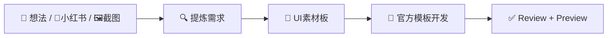
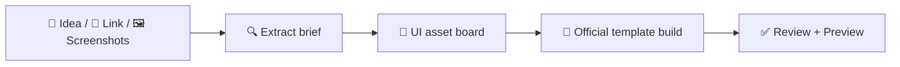

# Eazo Factory

Create one independent app per normal invocation. Prefer compact artifacts and one decisive pass over verbose planning. Do not deploy, publish, or push a remote repository.

## Batch mode

If the user asks for 批量, 一堆链接, many links, a `links.txt`/`jobs.json` file, "100 个小红书链接", "并行", "多开 Codex", or "把当前 directory 里的 file 里的链接都生成 app", invoke `$eazo-batch` instead of the single-app workflow.

Do not run the single-app stage machine in batch mode. `$eazo-batch` is responsible for launching separate `codex exec` workers, each of which invokes `@eazo-factory` for one independent app and writes `batch-report.json`.

## Onboarding mode

When the user invokes this plugin without a concrete app brief, do not run preflight, create files, call `$imagegen`, scaffold, or start a review. Instead, reply with a short onboarding guide in the user's language. If the request is only `@eazo-factory` and there is any Chinese in the surrounding conversation or product context, answer in Chinese. If no language signal exists, default to Chinese for this plugin.

Trigger onboarding when the request is empty, only names `@eazo-factory`, or mainly asks any of:

- how to use this plugin;
- what this plugin does;
- onboarding, help, usage, examples, prompt template;
- 怎么用, 能做什么, 介绍一下, 新手引导, 示例.

Onboarding response shape:

Use a polished Markdown welcome card in the user's language. Include emoji-based visual structure, a compact Mermaid diagram, and three numbered usage cards with small text/emoji illustrations. Do not call `$imagegen`, create files, or run preflight just to render onboarding.

Required Chinese layout:

````markdown
# ✨ Eazo Factory

把一句想法、小红书链接、或一组截图，变成一个可预览的双语 Eazo App。



## 三种使用方式

### 1. 一句话生成 App

📌 适合：你已经知道想做什么，比如冥想、日记、工具、小游戏。
🧩 你怎么发：说清楚 app 类型、用户、核心功能、风格、保存位置。
🖼 效果示意：
```text
💬 一句话想法
   ↓
🎨 UI素材板 + 🧩 官方模板
   ↓
📱 可运行 App
```

复制示例：
```text
@eazo-factory 创建一个马蒂斯剪纸风两分钟冥想 App，给焦虑上班族用，保存到桌面
```

### 2. 从小红书链接复刻

📌 适合：你看到一篇小红书内容，想把它变成互动 App。
🧩 你怎么发：直接丢链接；如果链接打不开，再补截图。
🖼 效果示意：
```text
🔗 小红书帖子
   ↓ 提炼内容 / 结构 / 视觉元素
📱 原创 Eazo 交互 App
```

复制示例：
```text
@eazo-factory 从这个小红书链接复刻成一个 Eazo App: https://www.xiaohongshu.com/...
```

### 3. 从截图/素材生成

📌 适合：你有多张帖子截图、UI参考、素材板，想让我理解后复刻。
🧩 你怎么发：上传截图，然后一句话说“按这些做”。
🖼 效果示意：
```text
🖼 截图组 / 素材板
   ↓ 识别文案 / 组件 / 色彩
🌐 双语 Eazo App
```

复制示例：
```text
@eazo-factory 按这几张小红书截图做成一个打卡/日记 App
```

## 我会产出

`需求提炼 → UI素材板 → 官方模板代码 → 验证 → 独立Review → 本地Preview`

准备好了，直接把想法、链接、或截图丢给我。
````

For English users, use this equivalent layout:

````markdown
# ✨ Eazo Factory

Turn one idea, Xiaohongshu link, or screenshot set into a previewable bilingual Eazo App.



## 3 ways to use it

### 1. Build from one sentence

📌 Best for: meditation, journal, utility, mini-game, or any app idea you can describe.
🧩 What to send: app type, audience, core function, style, and output folder.
🖼 Visual cue:
```text
💬 One app idea
   ↓
🎨 UI board + 🧩 official template
   ↓
📱 Working app
```

Copy example:
```text
@eazo-factory Create a Matisse cut-paper two-minute meditation app for anxious office workers, save to Desktop
```

### 2. Recreate from a Xiaohongshu link

📌 Best for: turning a post or carousel into an interactive app.
🧩 What to send: paste the link; add screenshots if the link is blocked.
🖼 Visual cue:
```text
🔗 Xiaohongshu post
   ↓ content / layout / motifs
📱 Original Eazo interaction
```

Copy example:
```text
@eazo-factory Turn this Xiaohongshu link into an Eazo app: https://www.xiaohongshu.com/...
```

### 3. Build from screenshots/assets

📌 Best for: screenshots, UI references, moodboards, or visual assets.
🧩 What to send: upload images, then say what kind of app to make.
🖼 Visual cue:
```text
🖼 Screenshots / assets
   ↓ copy / components / colors
🌐 Bilingual Eazo app
```

Copy example:
```text
@eazo-factory Make a check-in / journal app from these screenshots
```

## What I’ll produce

`product scope → UI reference board → official template code → verification → independent review → local preview`

Drop me the idea, link, or screenshots when you’re ready.
````

Keep onboarding under 900 Chinese characters or 460 English words unless the user asks for details.

## Source-material mode

When the user invokes Eazo Factory with a URL, screenshot, image set, pasted social post, or phrasing like "from this", "复刻这个", "照这个做", "从这个链接", treat the source material as the app brief. Do not ask for a separate written product prompt when the source is usable.

Supported source examples:

- Xiaohongshu URLs: `xiaohongshu.com`, `xhslink.com`, `xhs.cn`, or 小红书 links;
- one or more screenshots of a post, UI, carousel, notes, or visual reference;
- mixed input: a link plus screenshots or short extra instructions.

For source-material mode, insert a source intake stage before idea:

```text
source intake → idea → design
```

Source intake rules:

1. Explicitly invoke `$eazo-source` with the user's source material and staging directory.
2. Expected output: `<staging>/source/source-brief.json`.
3. For Xiaohongshu source material, `$eazo-source` must try XHS MCP first when an authenticated Xiaohongshu MCP/browser tool is available. If it succeeds, use its note detail, media, and screenshots as the source of truth. If it is unavailable, continue with browser/screenshot fallback. If it reports login required or verification blocked, stop and ask for MCP browser login or screenshots.
4. If `$eazo-source` reports that a Xiaohongshu link is blocked by login or verification and no screenshot/text contains enough information, stop with one concise sentence telling the user to 登录自己的小红书账号, 重新发送同一个链接, or 补充帖子截图.
5. Pass `source/source-brief.json` into `$eazo-idea` and `$eazo-design`.
6. For any visual source (Xiaohongshu link, product/intro screenshot, or UI/interaction reference), require `$eazo-source` to capture the referenced UI into `<staging>/source/reference-ui/` and list it in `reference_ui_images`. `$eazo-design` must pass those images into `$imagegen` as visual references, unless the user explicitly opted out of a reference image or specified a different UI/style.
7. Preserve the source's product intent, UI structure, visual motifs, content hierarchy, copy tone, and key elements. Create original Eazo UI; do not copy watermarks, creator identity, private data, or long verbatim captions.

## Resolve paths

Determine:

- plugin root: two directories above this skill;
- output root: user-provided location, or an `eazo-apps/` directory under the current workspace;
- app slug: supplied by `$eazo-idea`;
- final app directory: `<output-root>/<slug>`;
- staging directory: `<output-root>/.eazo-factory-runs/<slug>`.

The staging directory prevents pre-scaffold product and design artifacts from making the final destination non-empty.

## Stage machine

Execute every stage in order:

```text
preflight → optional source intake → idea → design → scaffold → build → verify → preview → independent review → optional one fix/re-review → final preview
```

Update `factory-run.json` at the durable milestones only: preflight, idea, design, scaffold, build, verify, preview, review, fix, final.

After each transition, call:

```bash
bash <plugin-root>/scripts/update-run.sh <run-path> <stage> <status> [preview-url] [increment-review]
```

Use `increment-review` value `1` only when starting a new independent review cycle. Add artifact and verification records to the same JSON without removing existing fields.

## Workflow

### 1. Preflight

Create resumable state before any check:

```bash
STAGING_DIR="$(bash <plugin-root>/scripts/init-run.sh <output-root> <provisional-slug>)"
```

This creates `factory-run.json` with stage `preflight`. Preserve it on every failure.

Confirm `$imagegen` is available in the current Codex skill/tool inventory. This capability cannot be inferred from a shell executable; record a failed preflight state and stop before creating product artifacts when it is unavailable.

Run:

```bash
bash <plugin-root>/scripts/preflight.sh <output-root> <provisional-slug>
```

Verify Codex, Git, Bun, Node, a writable output root, and access to the official Eazo template. Stop on failure.

### 2. Optional source intake

Run this stage only in source-material mode.

Explicitly invoke `$eazo-source` with:

- the user's URLs, screenshots, images, pasted post text, and any extra instruction;
- staging directory as target;
- expected output: `<staging>/source/source-brief.json`.

If source extraction succeeds with medium or high confidence, continue without asking for more user text. If extraction confidence is low but still contains a usable product intent, continue and let `$eazo-idea` simplify it. If a Xiaohongshu link is blocked by login/verification and not enough screenshot/text evidence exists, record a failed source state and stop with one sentence telling the user to log in to their own Xiaohongshu account, resend the same link, or upload screenshots. If the source is otherwise inaccessible and not enough screenshot/text evidence exists, record a failed source state and stop with one sentence asking for screenshots.

### 3. Idea

Use the staging directory returned by `init-run.sh`. Explicitly invoke `$eazo-idea` with:

- the user's request;
- `<staging>/source/source-brief.json` when source-material mode ran;
- staging directory as target;
- expected output: `<staging>/product-spec.json`.

The product spec must include `language-switching`. It must include `ambient-bgm` unless the app is explicitly utility-first/functional.

Read the generated slug from the artifact. Rename the staging directory when the provisional slug differs, preserving `factory-run.json`, and update its stage to `idea`.

### 4. Design

Explicitly invoke `$eazo-design` with:

- `<staging>/product-spec.json`;
- `<staging>/source/source-brief.json` when present;
- staging directory as target;
- expected outputs:
  - `<staging>/design/ui-reference.png`;
  - `<staging>/design/image-prompt.md`;
  - `<staging>/design/design-tokens.json`;
  - `<staging>/design/interaction-map.json`;
  - `<staging>/design/asset-library.json`.

Require the UI image to be a single reference board: one polished mobile frame plus a compact asset library grid of matched controls, decorative parts, background material, icons, state elements, motion notes, and BGM mood. Do not request multiple separate image variations.

Retry `$imagegen` once with a simplified prompt when image generation fails. If the retry also fails, record a failed design state and stop. A runnable Eazo Factory release requires a valid UI reference image.

### 5. Scaffold

Run:

```bash
bash <plugin-root>/scripts/scaffold-app.sh <output-root> <slug>
```

Copy `product-spec.json`, optional `source/`, and the complete `design/` directory from staging into the final app. Preserve the scaffolded `factory-run.json` and update its artifact records. Never copy staging Git metadata.

Merge the staging run's original `started_at`, stage history, verification, review count, and artifact records into the scaffolded run state:

```bash
bash <plugin-root>/scripts/merge-run-state.sh <staging>/factory-run.json <app-directory>/factory-run.json
```

Do this before deleting staging.

Append a clearly delimited `Generated App Contract` section to the official template's `AGENTS.md`. Preserve all official instructions. The appended section must point to the product/design artifacts, forbid controls outside `interaction-map.json`, and require `verify-app.sh` plus the independent review gate.

### 6. Build

Explicitly invoke `$eazo-build` with:

- final app directory;
- plugin root;
- all product and design artifact paths;
- expected output: implemented source and passing deterministic verification.

### 7. Verify

Run:

```bash
bash <plugin-root>/scripts/verify-app.sh <app-directory>
```

Do not proceed while deterministic blocking findings remain.

### 8. Preview

Run:

```bash
bash <plugin-root>/scripts/start-preview.sh <app-directory>
```

Record the returned URL.

### 9. Independent review

The Builder cannot approve its own work.

1. Spawn a fresh reviewer subagent with read-only application-source access when subagent tools are available.
2. Otherwise start a fresh independent Codex review thread/run.
3. Give it only the final app artifacts, preview URL, `$eazo-review`, and required rubric context. Do not pass Builder reasoning or self-review.
4. Explicitly invoke `$eazo-review`.
5. Require complete `review.json` and `control-audit.json` payloads.
6. Write those payloads into `<app-directory>/review/` without changing the verdict.
7. Run `bash <plugin-root>/scripts/validate-review.sh <app-directory>` and reject malformed, incomplete, or internally inconsistent review payloads.

If no independent reviewer context can be created, stop. Self-review is not an acceptable fallback.

### 10. Optional fix and re-review

When the verdict fails:

1. send all blocking and important findings to a Builder/Fixer context;
2. fix only the reported defects;
3. run deterministic verification again;
4. restart preview if needed;
5. launch a fresh independent reviewer context and invoke `$eazo-review` again.

Allow at most one fix-and-review cycle. Never weaken product requirements, the interaction map, verifier, or rubric to obtain a pass. If the second verdict fails, return the app path, preview command, and bounded fix list instead of continuing to spend tokens.

### 11. Final preview

Start or confirm the final healthy preview only when:

- deterministic verification passes;
- review score is at least 85;
- no blocking or important finding exists;
- control coverage status is `pass`;
- every discovered interactive control is mapped and passes;
- core and bug category minimums pass.

Enforce these gates mechanically:

```bash
bash <plugin-root>/scripts/validate-review.sh <app-directory> --require-pass
```

Remove staging only after all artifacts are present in the final app. Preserve it on any interrupted or failed run.

## Final response

Return:

- absolute app path;
- local preview URL, or exact restart command when the process cannot remain running;
- exact official template commit;
- verification status;
- review score and cycle count;
- number of discovered and passing controls;
- unresolved non-blocking findings.

Never report success when a blocking or important finding, failed audit entry, unmapped control, decorative button, or dead action remains.
